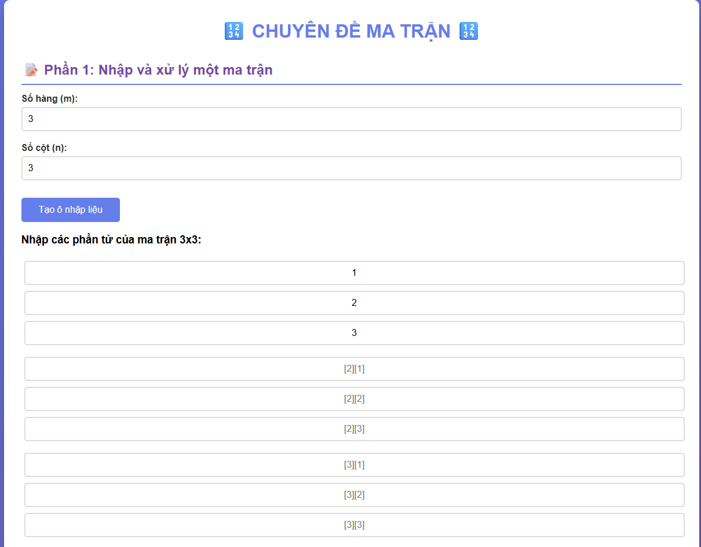
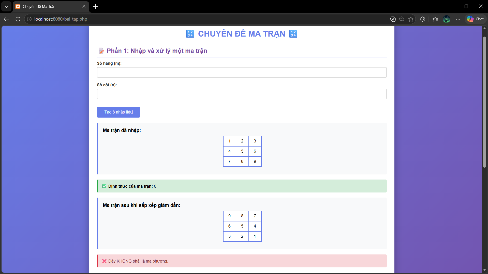
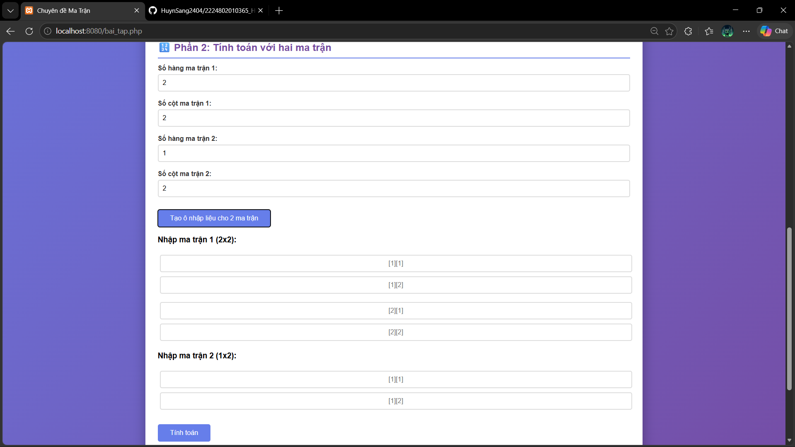
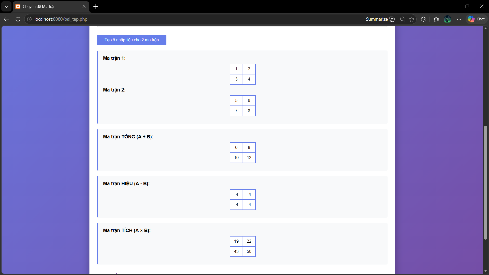
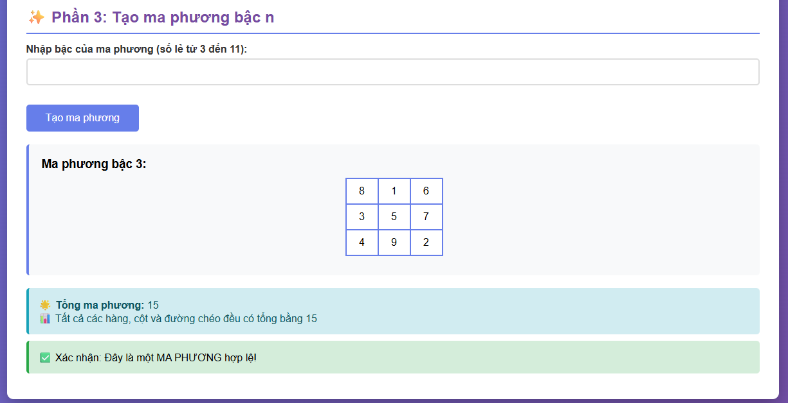

### Phần 1: Nhập và xử lý một ma trận

Cho phép nhập ma trận m×n, tính định thức (nếu ma trận vuông), sắp xếp giảm dần và kiểm tra ma phương.

### Phần 2: Tính toán với hai ma trận

Tính tổng, hiệu và tích của hai ma trận với kiểm tra điều kiện kích thước.

### Phần 3: Tạo ma phương

Tạo ma phương bậc lẻ (3, 5, 7, 9, 11...) sử dụng thuật toán Siamese.

